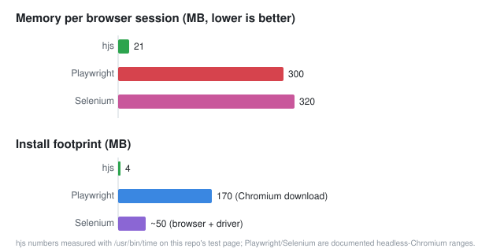

# hjs

A tiny stealth web browser for scraping, written in [Mojo](https://mojolang.org)
with JavaScript execution via QuickJS. Built to do the 95% of scraping jobs
where Playwright and Selenium are wildly oversized.

The whole stack is about 4 MB and roughly 21 MB of RAM per fetch. Playwright
with Chromium wants ~300 MB and a 170 MB download just to boot. You drive it
from Python, Go, or any MCP client (Claude Desktop, ZCode, etc).

It is not a browser emulator. It fetches pages, runs the page's JavaScript in
QuickJS with a working `fetch()`/XHR/event loop, parses HTML down to readable
text and structured data, keeps cookie sessions, rotates browser
fingerprints, and flags captcha walls so your pipeline can react. No layout,
no screenshots, no click pixels.

## Why bother



| | hjs | Playwright (Chromium) | Selenium (Chrome) |
|---|---|---|---|
| RAM per browser session | ~21 MB | ~300 MB | ~300 MB |
| Install size | 4 MB | ~170 MB (browser) + pip | ~15 MB + chromedriver |
| Cold start to first fetch | ~50 ms (daemon) / ~1 s (one-shot) | ~1 s (launch) | ~1 s + driver handshake |
| Runs JavaScript | Yes (QuickJS) | Yes (V8, full DOM) | Yes (V8, full DOM) |
| Screenshots / PDF / print | No | Yes | Yes |
| Clicks, hover, drag, file inputs | No (link navigation only) | Yes | Yes |
| Captcha/bot-wall detection | Built in, reported as data | DIY | DIY |
| Fingerprint profiles + rotation | Built in (UA, client hints, Sec-Fetch, ciphers) | DIY/stealth plugins | DIY |
| Cookie jar persistence | Built in (`curl -b/-c` style) | StorageState | Cookie API |
| robots.txt + sitemap helpers | Built in | No | No |
| MCP server (AI agent ready) | Included | Official | No |
| Codegen (record + replay) | Included (Python/Go) | Inspector | Record-and-playback |
| Parallel scraping workers | Process pool, no daemon per tab | Browser contexts | Drivers per session |
| Language of the core | Mojo (compiled, zero deps at runtime) | C++/node | Java/C# binaries |

RAM and timings were measured on this project's own test suite
(`hjs https://example.com`, 21.7 MB peak RSS, warm process ~50 ms).
Playwright/Selenium numbers are their documented headless-Chromium ranges.

### Why it is so much lighter

Playwright and Selenium both run a full Chrome. A "page" is a rendered
document: compositor, V8 isolate with DOM bindings, network stack, GPU
process. Most scrapers never touch any of that. They want the HTML after the
page's own JavaScript has done its work, and a few structured fields.

hjs keeps exactly that and deletes the rest:

* QuickJS instead of V8. Single-digit MB, no DOM bindings, no JIT tiers,
  no isolate heap. It runs real ES2020 (async/await, classes, promises).
* libcurl instead of Chrome's network stack. HTTP/2, TLS, cookies, gzip/brotli.
* The HTML is never parsed into a tree. Extraction is a single byte scan.
  Text, title, links, Open Graph and JSON-LD come out of that scan.
* No rendering. No layout, no raster, no GPU process, no 100 MB of V8 heap.

That is the 15x RAM difference. When your scraper ran 12 Chrome tabs on a
1-core box and pinned it at load 12, this runs the same URLs as 12 processes
at 21 MB each and the CPU is mostly waiting on the network.

## Install

The binary is a Linux x86-64 ELF (WSL on Windows is fine). Three files:

```
hjs                 the binary (160 KB)
libhjs.so           QuickJS engine + C shim (3.8 MB)
browser_profiles.txt  fingerprint profiles, edit freely
```

```sh
mkdir -p /opt/hjs && cp hjs libhjs.so browser_profiles.txt /opt/hjs/
ln -s /opt/hjs/hjs /usr/local/bin/hjs
```

The `hjs` binary needs libcurl (present on every normal Linux) and
`LD_LIBRARY_PATH` pointed at the Mojo runtime libs **only when built from
source** (see `engine/`). The shipped binary has its paths baked in; if you
move the Mojo toolchain, set `MODULAR_MOJO_MAX_SYSTEM_LIBS` accordingly or
rebuild.

Python SDK:

```sh
pip install ./sdk-python
```

Go SDK:

```sh
go get github.com/ahurkkkkkkk/hjs/sdk-go
```

## Quick start

### Python

```python
from hjs import Browser

with Browser(profile="chrome131") as b:
    page = b.goto("https://example.com")
    print(page.status, page.title)
    print(page.text[:300])

    # structured data: OG tags, meta, JSON-LD, links with anchor text
    data = page.structured()
    print(data["og"]["og:title"], len(data["json_ld"]))

    # follow a link, session cookies and referer chain follow automatically
    p2 = b.goto(data["links"][0]["href"])

    # scrape 4 URLs in parallel, one shared session
    pages = b.scrape(["https://a.com", "https://b.com"], workers=4)

    # robots.txt and sitemaps
    robots = b.robots("https://example.com")
    if robots.allowed("https://example.com/page"):
        for url in b.sitemap("https://example.com"):
            print(url)
```

### Go

```go
b, err := hjs.New(hjs.Options{Profile: "chrome131", Session: true})
if err != nil { log.Fatal(err) }
defer b.Close()

p, err := b.Goto("https://example.com", nil)
fmt.Println(p.Status, p.Title, len(p.Links))

pages, errs := b.ScrapeAll(ctx, urls, 4)
```

### Fingerprint rotation

```python
b = Browser(profiles=["chrome131", "firefox133", "safari17", "edge131"])
for url in urls:
    b.goto(url)  # cycles to the next browser identity every request
```

### Parallel with per-host politeness

```python
b = Browser(profile="chrome131", per_host_delay_ms=1500, retries=3)
pages = b.scrape(urls, workers=8)   # 8 in flight, max 1 req/1.5s per host
```

## Stealth and anti-block features

* **Browser profiles**: five ready-made identities (Chrome 131 desktop/mobile,
  Firefox 133, Safari 17, Edge 131). Each bundles a real User-Agent,
  `sec-ch-ua` client hints, `Sec-Fetch-*` headers, `Accept`/`Accept-Language`
  and a browser-matching TLS cipher list. Profiles are plain text in
  `browser_profiles.txt`. Add your own by copying a block.
* **Cookies**: `--cookies=/--cookie-jar=` give you persistent, Netscape-format
  sessions across runs. The SDK keeps a session jar per Browser.
* **Referer chaining**: every `goto` inside a session sends the previous page
  as the Referer, exactly like clicking through a site.
* **TLS**: HTTP/2 with fallback, TLS floor 1.2 or 1.3, custom cipher lists.
* **Proxy**: any curl proxy URL (`socks5://`, `http://`) via `--proxy=`.
* **Rate limiting**: `--delay-ms` per request, `per_host_delay_ms` for the
  pool, `--retries` + linear `--backoff-ms` on 429/5xx/timeouts.
* **Captcha/bot-wall detection**: every response is checked for Cloudflare,
  PerimeterX, reCAPTCHA, hCaptcha, DataDome and Incapsula markers. Detected
  walls come back as `page.captcha == "cloudflare"` so your code can route
  the URL to a solver or drop it. Detection only; nothing solves captchas.
* **Stall kill**: transfers below 1 KB/s for 30 s abort on their own so a
  dead connection never hangs a job.

### Honest limits

The TLS handshake is OpenSSL. HTTP-level headers are browser-shaped, but a
JA3/JA4 fingerprint check will not match real Chrome. Sites that gate on TLS
fingerprints (a minority of anti-bot vendors) need curl-impersonate or a
real browser. If you get `blocked: cloudflare` back and retries with fresh
cookies do not clear it, that is the signal to escalate the tool, not to
add headers.

External `<script src>` files are not executed, only inline scripts. Pages
that build their entire DOM with React/Vue and never touch `document.body`
text properties will still come back thin.

## MCP server (AI agents)

`mcp_server.py` speaks Model Context Protocol over stdio. Add to Claude
Desktop or ZCode:

```json
{
  "mcpServers": {
    "hjs": {
      "command": "python3",
      "args": ["/opt/hjs/mcp_server.py"],
      "env": {"HJS_BIN": "/usr/local/bin/hjs"}
    }
  }
}
```

10 tools: `hjs_goto`, `hjs_extract`, `hjs_html`, `hjs_links`,
`hjs_click_link`, `hjs_wait_for`, `hjs_scrape`, `hjs_sitemap`,
`hjs_robots`, `hjs_session`. The agent gets text plus numbered links and
can click through a site while one session (cookies + referer chain) is
preserved across calls. `python3 mcp_server.py --self-test` proves the
protocol end to end.

## CLI

```
hjs <url> [--mode=text|html|json] [--timeout=15] [--max=2097152]
          [--profile=chrome131] [--ua=...] [--cookies=F] [--cookie-jar=F]
          [--referer=URL] [--proxy=URL] [--http1] [--min-tls=1.2|1.3]
          [--ciphers=LIST] [--delay-ms=N] [--retries=N] [--backoff-ms=N]
          [--js/--no-js] [--js-budget-ms=3000] [--links] [--no-meta] [--quiet]
```

Exit codes: 0 ok, 1 usage error, 2 network error, 3 HTTP error status.

## Repo layout

```
binary/            prebuilt hjs + libhjs.so + browser_profiles.txt
engine/            hjs.mojo, hjs_shim.c, build-from-source guide
sdk-python/        hjs.py, mcp_server.py, tests, examples
sdk-go/            hjs.go module, tests, examples
sibling-hbrowser/  hbrowser.mojo, the no-JS 120 KB variant
docs/              feature and deployment guides
```

## Building from source

`engine/BUILDING.md` has the full toolchain recipe (Mojo 1.0.0 wheels,
QuickJS, the two config files that trip people up). Quick version on
Linux/WSL:

```sh
# engine/hjs_shim.c + quickjs -> libhjs.so
gcc -O2 -fPIC -shared -Iquickjs -o libhjs.so hjs_shim.c libquickjs.a -lm -ldl -lpthread
# engine/hjs.mojo -> hjs
MODULAR_MOJO_MAX_SYSTEM_LIBS=/usr/lib/x86_64-linux-gnu/libcurl.so.4 \
  mojo build -I <mojo-home>/lib/mojo hjs.mojo -o hjs
```

## Tests

```sh
cd sdk-python && HJS_BIN=/usr/local/bin/hjs python3 test_hjs_sdk.py   # 39 checks
cd sdk-go     && HJS_BIN=/usr/local/bin/hjs go test ./...              # 15 checks
python3 sdk-python/mcp_server.py --self-test                           # MCP protocol
```

## License

MIT. See LICENSE.
