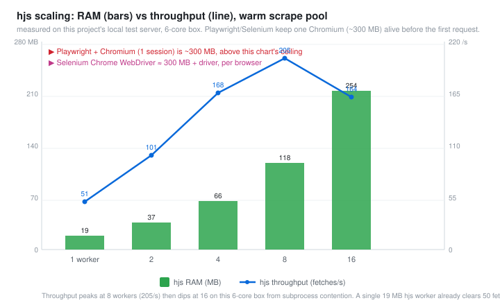

# hjs

A tiny stealth web browser for scraping, written in [Mojo](https://mojolang.org)
with JavaScript execution via QuickJS. Built to do the 95% of scraping jobs
where Playwright and Selenium are wildly oversized.

The whole stack is about 4 MB and roughly 21 MB of RAM per fetch. Playwright
with Chromium wants ~300 MB and a 170 MB download just to boot. A single hjs
worker clears ~50 fetches/s on localhost and 8 of them hit ~205/s on a 6-core
box, all under 120 MB total. You drive it from Python, Go, or any MCP client
(Claude Desktop, ZCode, etc).

It is not a browser emulator. It fetches pages, runs the page's JavaScript in
QuickJS with a working `fetch()`/XHR/event loop, parses HTML down to readable
text and structured data, keeps cookie sessions, rotates browser
fingerprints, and flags captcha walls so your pipeline can react. It has no
layout engine, so it will never give you pixel-perfect screenshots. The
`hjs-tplugin` plugin closes most of that gap with PDF export, a PNG content
snapshot, reader text, print output, and a line-based scroll/touch model, all
still in pure stdlib and all still ~20 MB.

## Why bother


| | hjs | Playwright (Chromium) | Selenium (Chrome) |
|---|---|---|---|
| RAM per browser session | ~21 MB | ~300 MB | ~300 MB |
| RAM for 8 parallel workers | ~118 MB | ~2400 MB (8 Chromium) | ~2400 MB |
| Install size | 4 MB | ~170 MB (browser) + pip | ~15 MB + chromedriver |
| Process start to first fetch | ~22 ms | ~1 s browser launch | ~1 s + driver handshake |
| Runs JavaScript | Yes (QuickJS, ES2020) | Yes (V8, full DOM) | Yes (V8, full DOM) |
| PDF export | Built in (`hjs-tplugin`) | Yes | Yes |
| PNG screenshot | Content snapshot (no layout) | Full pixel render | Full pixel render |
| Scroll / tap links | Built in (line hit-test) | Yes (pixels) | Yes (pixels) |
| Form submit (POST/JSON) | Built in, session-aware | `fill`/`click`/`submit` | `find_element`/`click` |
| Structured extract (OG, JSON-LD) | Built in | DIY | DIY |
| Captcha/bot-wall detection | Built in, reported as data | DIY | DIY |
| Fingerprint profiles + rotation | Built in (UA, client hints, Sec-Fetch, ciphers) | DIY/stealth plugins | DIY |
| Cookie jar persistence | Built in (`curl -b/-c` style) | StorageState | Cookie API |
| robots.txt + sitemap helpers | Built in | No | No |
| MCP server (AI agent ready) | 17 tools included | Official server | No |
| Codegen (record + replay) | Included (Python/Go) | Inspector | Record-and-playback |
| Parallel scraping | Process pool, no per-tab daemon | Browser contexts | Drivers per session |

hjs RAM and timings were measured with `time -v` and a scrape benchmark on this
repo (see [Benchmarks](#benchmarks)). Playwright/Selenium numbers are their
documented headless-Chromium ranges.

### Why it is so much lighter

Playwright and Selenium both run a full Chrome. A "page" is a rendered
document: compositor, V8 isolate with DOM bindings, network stack, GPU
process. Most scrapers never touch any of that. They want the HTML after the
page's own JavaScript has done its work, plus a few structured fields.

hjs keeps exactly that and deletes the rest:

* QuickJS instead of V8. Single-digit MB, no DOM bindings, no JIT tiers, no
  isolate heap. It runs real ES2020 (async/await, classes, promises).
* libcurl instead of Chrome's network stack. HTTP/2, TLS, cookies, gzip/brotli.
* The HTML is never parsed into a tree. Extraction is a single byte scan. Text,
  title, links, Open Graph and JSON-LD come out of that scan.
* No rendering pipeline. No layout, no raster, no GPU process, no 100 MB of V8
  heap. That is where the 15x RAM difference comes from.

When your scraper ran 12 Chrome tabs on a 1-core box and pinned it at load 12,
this runs the same 12 URLs as 12 workers at ~21 MB each and the CPU mostly
sits idle waiting on the network.

## Benchmarks

All numbers below are measured on this project (6-core WSL2 box, local test
server so the network is not the bottleneck; `scrape(...)` warms first, then
runs 24x per worker).



| workers | peak RAM | fetches/s (local) |
|---|---|---|
| 1 | 19 MB | ~51 |
| 2 | 37 MB | ~101 |
| 4 | 66 MB | ~168 |
| 8 | 118 MB | ~205 |
| 16 | 254 MB | ~164 (subprocess contention on 6 cores) |

Notes, stated plainly so the numbers are not misread:

* 51 fetches/s single worker is against a localhost test server. Real internet
  work is bound by the remote host and RTT, so throughput there is set by how
  politely you crawl, not by hjs. A 1-second-per-host delay means 1 host/s no
  matter what the tool is.
* The honest ceiling is memory. To run 500 Chromium tabs you need ~150 GB; the
  same 500 hjs workers need ~10 GB. That gap is the whole argument.
* A single hjs process is ~22 ms to start and fetch, which is why the process
  per request model here is cheap. Playwright amortizes browser startup across
  a long-lived context, which is the right call when you need a real DOM.

## Install

The binary is a Linux x86-64 ELF (WSL on Windows is fine). Three files:

```
hjs                   the binary (~160 KB)
libhjs.so             QuickJS engine + C shim (3.8 MB)
browser_profiles.txt  fingerprint profiles, edit freely
```

```sh
mkdir -p /opt/hjs && cp hjs libhjs.so browser_profiles.txt /opt/hjs/
ln -s /opt/hjs/hjs /usr/local/bin/hjs
```

The `hjs` binary needs libcurl (present on every normal Linux) and, if you
built from source, `LD_LIBRARY_PATH` pointed at the Mojo runtime libs (see
`engine/BUILDING.md`).

Python SDK (no third-party dependencies, stdlib only):

```sh
pip install ./sdk-python
```

Go SDK:

```sh
go get github.com/ahurkkkkkkk/hjs/sdk-go        # client
# tplugin ships in the same module:
import "github.com/ahurkkkkkkk/hjs/sdk-go/tplugin"
```

## Quick start

### Python

```python
from hjs import Browser

with Browser(profile="chrome131") as b:
    page = b.goto("https://example.com")
    print(page.status, page.title)
    print(page.text[:300])

    # structured data: OG tags, meta, JSON-LD, links with anchor text
    data = page.structured()
    print(data["og"]["og:title"], len(data["json_ld"]))

    # follow a link; session cookies and referer chain follow automatically
    p2 = b.goto(data["links"][0]["href"])

    # scrape 4 URLs in parallel, one shared session
    pages = b.scrape(["https://a.com", "https://b.com"], workers=4)

    # robots.txt and sitemaps
    robots = b.robots("https://example.com")
    if robots.allowed("https://example.com/page"):
        for url in b.sitemap("https://example.com"):
            print(url)
```

### Go

```go
b, err := hjs.New(hjs.Options{Profile: "chrome131", Session: true})
if err != nil { log.Fatal(err) }
defer b.Close()

p, err := b.Goto("https://example.com", nil)
fmt.Println(p.Status, p.Title, len(p.Links))

pages, errs := b.ScrapeAll(ctx, urls, 4)
```

### Forms and login (submit)

The Playwright way is to fill fields and click. hjs does it as a direct form or
JSON post that carries your session cookies and referer, so login-then-scrape
works without a DOM:

```python
b = Browser(profile="chrome131")
b.goto("https://site.example/login")
b.submit("https://site.example/login",
         data={"user": "me", "pass": "secret"})   # cookies + CSRF token now live
page = b.goto("https://site.example/dashboard")  # authenticated
```

```go
b.Goto(loginURL, nil)
b.Submit(loginURL, map[string]string{"user":"me","pass":"secret"}, nil, nil)
p, _ := b.Goto("https://site.example/dashboard", nil)
```

### hjs-tplugin: PDF, PNG, reader, print, touch and scroll

A pure-stdlib rendering plugin (Python `hjs_tplugin.py`, Go `tplugin` package).
No Pillow, no reportlab, no wkhtmltopdf, no Chromium: it ships its own 5x7
bitmap font, a hand-written PNG encoder and a hand-written PDF writer.

```python
from hjs import Browser
import hjs_tplugin as t

b = Browser(profile="chrome131")
page = b.goto("https://news.ycombinator.com")

open("page.pdf", "wb").write(t.pdf(page))        # paginated, valid PDF 1.4
open("shot.png", "wb").write(t.screenshot(page)) # text rendered to an image

print(t.reader(page)[:200])                      # main text, boilerplate out
print(t.print_(page))                             # form-feed paginated plain text

v = t.Viewer(page)                                # scroll + touch over the text
print(v.scroll(20))                              # 20 rows down, visible lines
target = v.tap_text("Show more")                 # hit-test a link by text
if target:
    b.goto(target)
```

```go
import "github.com/ahurkkkkkkk/hjs/sdk-go/tplugin"

pdf  := tplugin.PDF(p, 56)
png  := tplugin.Screenshot(p, 2)
main := tplugin.Reader(p)
v    := tplugin.NewViewer(p, 24)
v.Scroll(20)
if url := v.TapText("Show more"); url != "" { b.Goto(url, nil) }
```

`screenshot` is a content snapshot, not a pixel render. hjs has no layout
engine, so the PNG is the extracted text laid out on a grid with link lines
highlighted, good enough to eyeball a page or attach to a report. If you need
the exact pixels Chrome paints, that is the one job Playwright is built for and
this does not fake it.

### Fingerprint rotation

```python
b = Browser(profiles=["chrome131", "firefox133", "safari17", "edge131"])
for url in urls:
    b.goto(url)  # cycles to the next browser identity every request
```

### Parallel with per-host politeness

```python
b = Browser(profile="chrome131", per_host_delay_ms=1500, retries=3)
pages = b.scrape(urls, workers=8)   # 8 in flight, max 1 req/1.5s per host
```

## Stealth and anti-block features

* **Browser profiles**: five ready-made identities (Chrome 131 desktop/mobile,
  Firefox 133, Safari 17, Edge 131). Each bundles a real User-Agent, `sec-ch-ua`
  client hints, `Sec-Fetch-*` headers, `Accept`/`Accept-Language` and a
  browser-matching TLS cipher list. Profiles are plain text in
  `browser_profiles.txt`; add your own by copying a block.
* **Cookies**: `--cookies=FILE` and `--cookie-jar=FILE` give persistent,
  Netscape-format sessions across runs. The SDK keeps a session jar per Browser.
* **Referer chaining**: every `goto` inside a session sends the previous page as
  the Referer, like clicking through a site.
* **TLS**: HTTP/2 with fallback, TLS floor 1.2 or 1.3, custom cipher lists.
* **Proxy**: any curl proxy URL (`socks5://`, `http://`) via `--proxy=`.
* **Rate limiting**: `--delay-ms` per request, `per_host_delay_ms` for the pool,
  `--retries` + linear `--backoff-ms` on 429/5xx/timeouts.
* **Captcha/bot-wall detection**: every response is checked for Cloudflare,
  PerimeterX, reCAPTCHA, hCaptcha, DataDome and Incapsula markers. Detected
  walls come back as `page.captcha == "cloudflare"` so your code can route the
  URL to a solver or drop it. Detection only; nothing solves captchas.
* **Stall kill**: transfers below 1 KB/s for 30 s abort on their own so a dead
  connection never hangs a job.

### Honest limits

The TLS handshake is OpenSSL. HTTP-level headers are browser-shaped, but a
JA3/JA4 fingerprint will not match real Chrome. Sites that gate on TLS
fingerprints (a minority of anti-bot vendors) need curl-impersonate or a real
browser. If you get `blocked: cloudflare` back and retries with fresh cookies do
not clear it, that is the signal to escalate the tool, not to add headers.

External `<script src>` files are not fetched, only inline scripts run. Pages
that build their whole DOM with React/Vue and never set body text still extract
thin, because there is no layout engine to reconstruct what the script painted.

## MCP server (AI agents)

`sdk-python/mcp_server.py` speaks Model Context Protocol over stdio. Add it to
Claude Desktop or ZCode:

```json
{
  "mcpServers": {
    "hjs": {
      "command": "python3",
      "args": ["/opt/hjs/mcp_server.py"],
      "env": {"HJS_BIN": "/usr/local/bin/hjs"}
    }
  }
}
```

17 tools: `hjs_goto`, `hjs_submit`, `hjs_extract`, `hjs_html`, `hjs_links`,
`hjs_click_link`, `hjs_tap`, `hjs_scroll`, `hjs_screenshot`, `hjs_pdf`,
`hjs_print`, `hjs_reader`, `hjs_wait_for`, `hjs_scrape`, `hjs_sitemap`,
`hjs_robots`, `hjs_session`. An agent gets text plus numbered links, can click
or tap through a site, take a snapshot or PDF, and one session (cookies plus
referer chain) is preserved across calls. `python3 mcp_server.py --self-test`
drives the whole protocol end to end and checks a real screenshot and PDF land
on disk.

## CLI

```
hjs <url> [--mode=text|html|json] [--timeout=15] [--max=2097152]
          [--profile=chrome131] [--ua=...] [--cookies=F] [--cookie-jar=F]
          [--referer=URL] [--proxy=URL] [--http1] [--min-tls=1.2|1.3]
          [--ciphers=LIST] [--delay-ms=N] [--retries=N] [--backoff-ms=N]
          [--method=GET|POST|...] [--body=DATA]
          [--js/--no-js] [--js-budget-ms=3000] [--links] [--no-meta] [--quiet]
```

Exit codes: 0 ok, 1 usage error, 2 network error, 3 HTTP error status.

## Repo layout

```
binary/            prebuilt hjs + libhjs.so + browser_profiles.txt
engine/            hjs.mojo, hjs_shim.c, build-from-source guide
sdk-python/        hjs.py, hjs_tplugin.py, mcp_server.py, tests, examples
sdk-go/            hjs.go module, tplugin/ package, tests
sibling-hbrowser/  hbrowser.mojo, the no-JS 120 KB variant
docs/              memory + scaling charts, feature and deployment guides
```

## Building from source

`engine/BUILDING.md` has the full toolchain recipe (Mojo 1.0.0 wheels, QuickJS,
the config files that trip people up) and the gotchas list. Short version on
Linux/WSL:

```sh
# engine/hjs_shim.c + quickjs -> libhjs.so
gcc -O2 -fPIC -shared -Iquickjs -o libhjs.so hjs_shim.c libquickjs.a -lm -ldl -lpthread
# engine/hjs.mojo -> hjs
MODULAR_MOJO_MAX_SYSTEM_LIBS=/usr/lib/x86_64-linux-gnu/libcurl.so.4 \
  mojo build -I <mojo-home>/lib/mojo hjs.mojo -o hjs
```

## Tests

Everything is deterministic against a local test server, no live network needed
after the binary exists:

```sh
cd sdk-python && HJS_BIN=/usr/local/bin/hjs python3 test_hjs_sdk.py   # 42 checks
cd sdk-python && python3 test_tplugin.py                              # 23 checks
cd sdk-go     && HJS_BIN=/usr/local/bin/hjs go test ./...              # 17 + tplugin
python3 sdk-python/mcp_server.py --self-test                           # MCP protocol, 17 tools
```

## License

MIT. See LICENSE.
